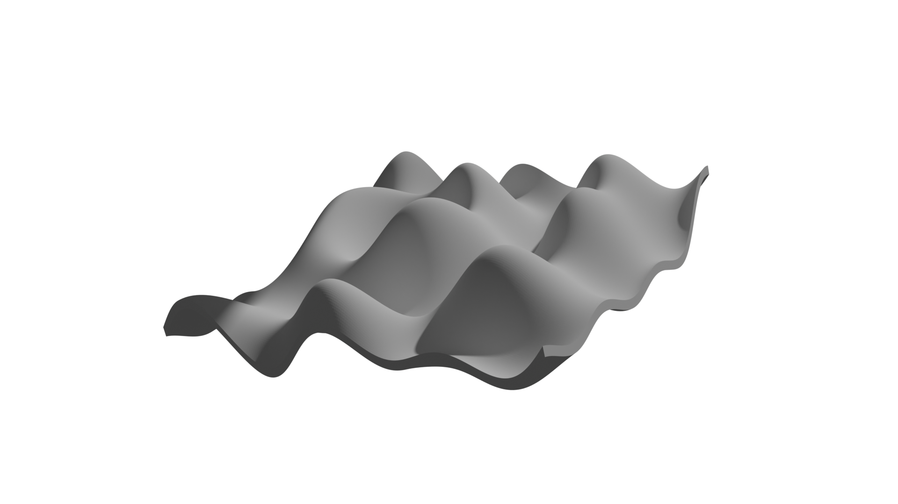
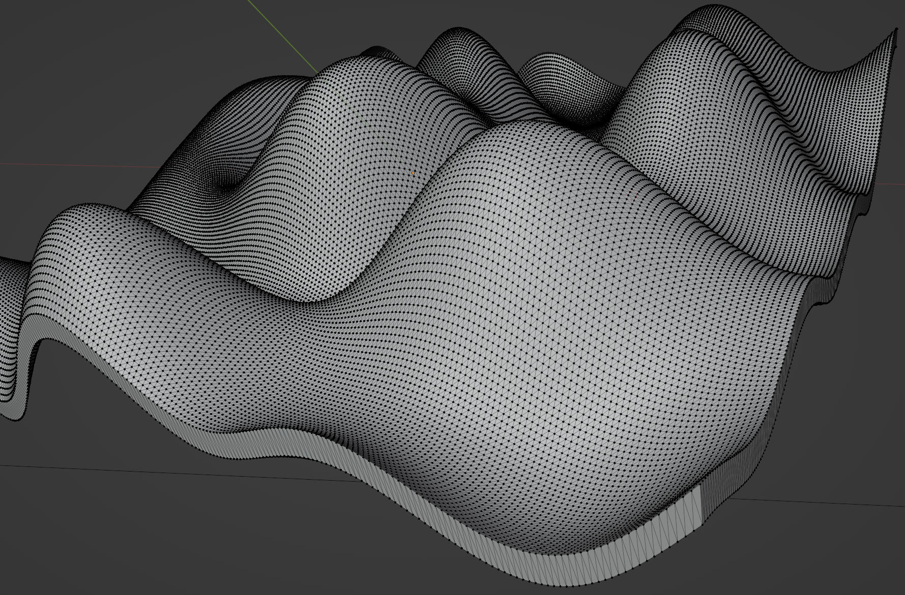

# Object dataset

This script generate a object with complex smouth surface. The surface are parametrized by two features [frequency, amplitude].
The script generate numpy array of white noise and apply a 2D butterworth filter to keep only frequencies in a given range.
The numpy array is then converted saved as a .npy file and in a .png image.
Then the numpy array is converted to a triangle mesh: 2 triangles per set of 4 points.
Then the mesh is saved as a .stl file.

# Images

